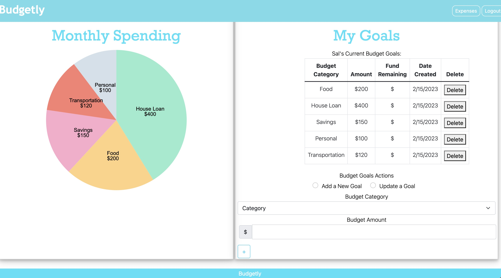
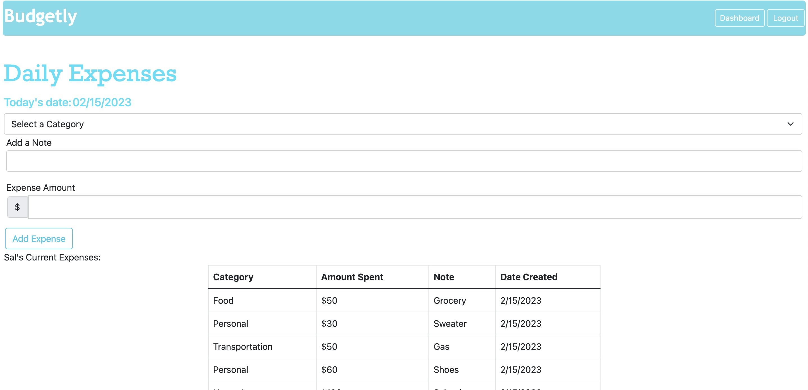

# Budgetly

## Description

Budgetly is a budgeting application that allows users to easily manage their finances. Budgetly analyzes your income and expenses and helps you understand how much you have available to spend per month. 

Users can view past spending patterns by category and make it easy to create future spending goals. Users can create an account, login, input daily expenses, create budget goals, and track their expense comparisons. Users will gain a visual understanding of their budgets by category and understand their remaining funds. 

With Budgetly, users have an easy way to track their finances and optimize their budget.

## User Story

As a user,
I WANT to track my expenses all in one place 
SO THAT I can keep my spending within my budget.

## Acceptance Criteria

GIVEN a budget dashboard with form inputs
WHEN I click on add a budget, and input the category and amount 
THEN I am presented with a new budget goal alongside its budget, amount, and fund remaining.
WHEN I click on update a budget, and input the category and amount 
THEN I am presented with an updated budget goal alongside its budget, amount, and fund remaining.
WHEN I click on the 'expenses' option in the navigation bar
THEN I am presented with a new page that display up to 50 of my most recent expenses
WHEN I input a category, description, and amount
THEN I am presented with a new expense described by its category, description, and amount, and the fund remaining in the budget dashboard updates.
WHEN I click on the 'logout' option in the navigation bar
THEN I am logged out of Budgetly 

## Table of Contents

- [Installation](#installation)
- [Usage](#usage)
- [License](#license)
- [Features](#features)
- [Tests](#tests)

## Installation

No Install Needed. To access the website, use the link below.

<!-- need to add -->
[Live website](https://.herokuapp.com/)

## Usage

1. Open the website using the following link:

    <!-- need to add -->
    [Live website](https://.herokuapp.com/)

2. Click the 'Login' button if you do not already have an account.

3. Enter your budget goals with the following information: category and amount.

4. Click the '+' button to set the current budget goal.

5. In the 'expenses' page (accessible through the navigation bar), add your expenses using the folling information: category, description, and amount.

6. Click the 'Add Expense' button to set the current expense.

7. Return to the budget 'dashboard' (accessible through the navigation bar), and view your fund remaining by category.

<!-- Here is a [Link](https://drive.google.com/file/d/1J98GbnfviYuA_mH7z8nOgGvGrsD6c4Bs/view?usp=sharing) to a walkthrough video that demonstrates the functionality of the application. -->

Example of the application's appearance and functionality:

## License

MIT License

Copyright (c) [2022]

Permission is hereby granted, free of charge, to any person obtaining a copy
of this software and associated documentation files (the "Software"), to deal
in the Software without restriction, including without limitation the rights
to use, copy, modify, merge, publish, distribute, sublicense, and/or sell
copies of the Software, and to permit persons to whom the Software is
furnished to do so, subject to the following conditions:

The above copyright notice and this permission notice shall be included in all
copies or substantial portions of the Software.

THE SOFTWARE IS PROVIDED "AS IS", WITHOUT WARRANTY OF ANY KIND, EXPRESS OR
IMPLIED, INCLUDING BUT NOT LIMITED TO THE WARRANTIES OF MERCHANTABILITY,
FITNESS FOR A PARTICULAR PURPOSE AND NONINFRINGEMENT. IN NO EVENT SHALL THE
AUTHORS OR COPYRIGHT HOLDERS BE LIABLE FOR ANY CLAIM, DAMAGES OR OTHER
LIABILITY, WHETHER IN AN ACTION OF CONTRACT, TORT OR OTHERWISE, ARISING FROM,
OUT OF OR IN CONNECTION WITH THE SOFTWARE OR THE USE OR OTHER DEALINGS IN THE
SOFTWARE.

## Features

1. JavaScript
2. Bootstrap
3. D3
4. Node.js
5. Express.js
6. Asyn
7. YNAB library (new)
8. JQuery
9. RESTful API
10. MYSQL
11. Sequelize ORM 
12. Handlebars.js
13. Express-session  
14. Cookies
15. Environment
16. Heroku

## Tests

Insomnia testing:

